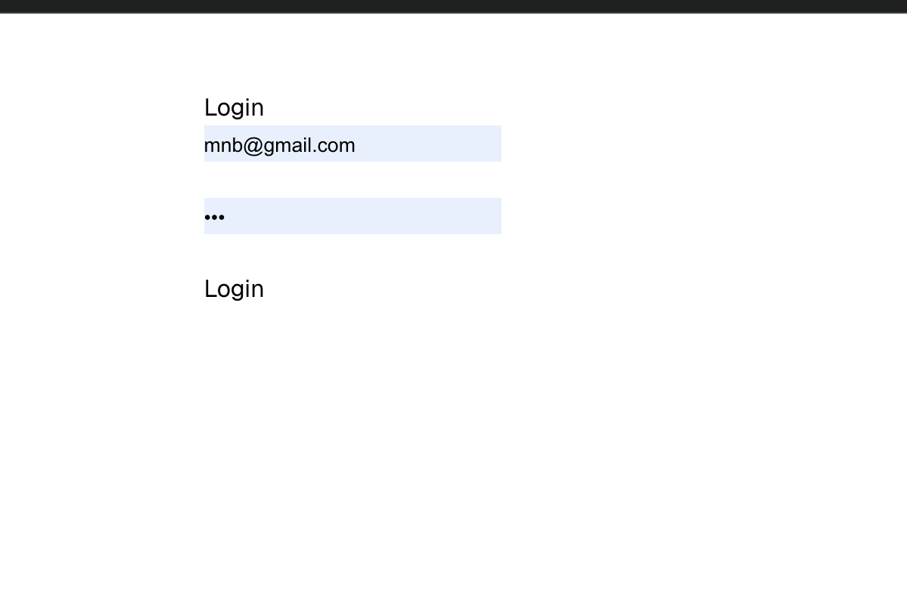
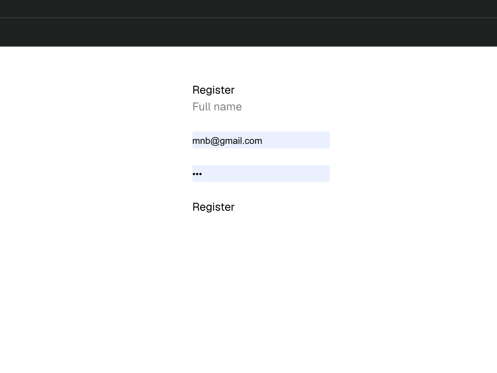
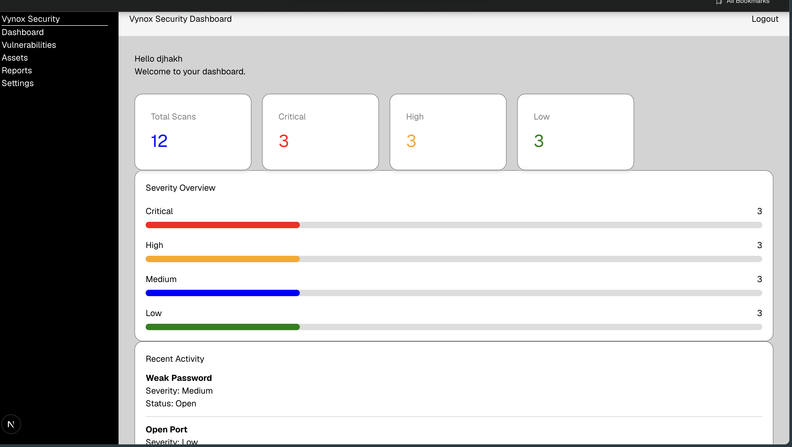
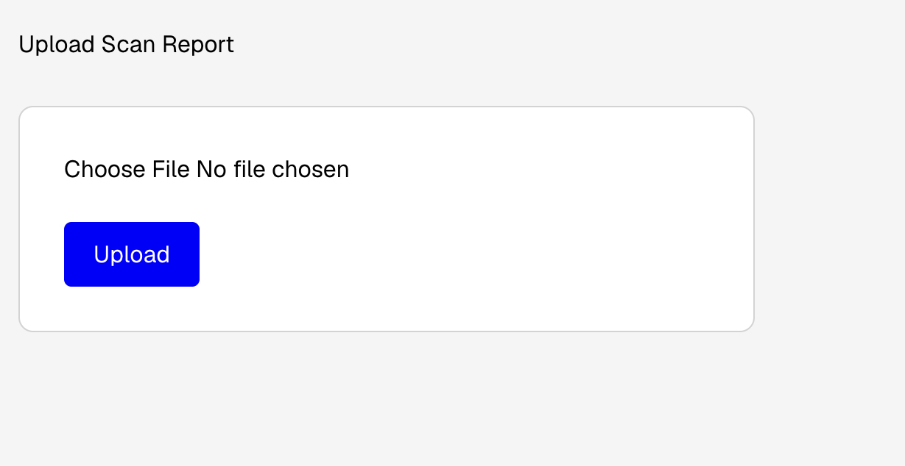
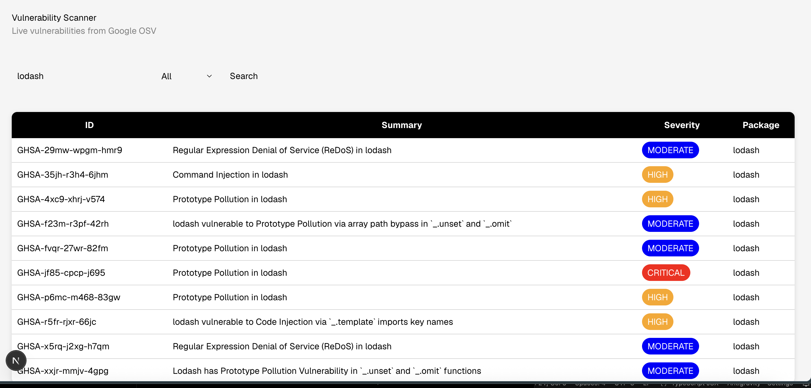

# Vynox Security Dashboard

## Overview

Vynox Security Dashboard is a web application built using Next.js, TypeScript, Prisma, and PostgreSQL.

The application allows users to register, log in securely, upload vulnerability scan reports, and view security information through a simple dashboard. It also integrates with the Google Open Source Vulnerabilities (OSV) API to search real-world package vulnerabilities.

---

## Features

- Secure user registration and login
- JWT-based authentication
- Protected dashboard
- Upload scan report page
- Dashboard with vulnerability statistics
- Recent activity section
- Severity overview
- Search vulnerabilities by package name
- Filter vulnerabilities by severity
- Google OSV API integration
- PostgreSQL database with Prisma ORM

---

## Tech Stack

- Next.js (App Router)
- TypeScript
- PostgreSQL
- Prisma ORM
- Google OSV API
- CSS

---

## Project Structure

```
app/
 ├── dashboard/
 ├── login/
 ├── register/
 ├── upload/
 ├── vulnerabilities/
 ├── api/

lib/
prisma/
public/
```

---

## Installation

### 1. Clone the repository

```bash
git clone https://github.com/your-username/vuln-dashboard.git
```

### 2. Open the project

```bash
cd vuln-dashboard
```

### 3. Install dependencies

```bash
npm install
```

### 4. Create a `.env` file

```env
DATABASE_URL=your_database_url
JWT_SECRET=your_secret_key
```

### 5. Run Prisma Migration

```bash
npx prisma migrate dev
```

### 6. Start the development server

```bash
npm run dev
```

Open your browser:

```
http://localhost:3000
```

---

## Usage

1. Register a new account.
2. Log in using your credentials.
3. Access the protected dashboard.
4. Upload a scan report.
5. View vulnerability statistics.
6. Search packages such as:

- lodash
- express
- react
- axios

7. Filter vulnerabilities by severity.

---

## API

This project uses the Google Open Source Vulnerabilities (OSV) API.

```
https://api.osv.dev
```

---

## Screenshots

### Login Page



### Register Page



### Dashboard



### Upload Scan Report



### Vulnerabilities



---

## Future Improvements

- Process uploaded scan reports automatically
- Download vulnerability reports
- Better charts and analytics
- Dark mode support
- User profile management

---

## Author

**Akash Dhar Dubey**

B.Tech Computer Science (AI & ML)

Ajeenkya DY Patil University